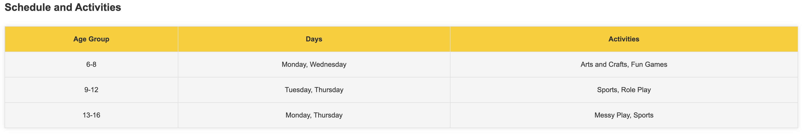
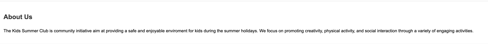
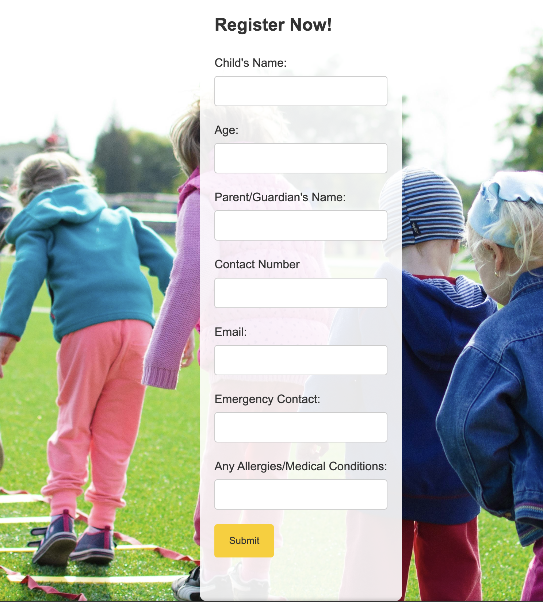
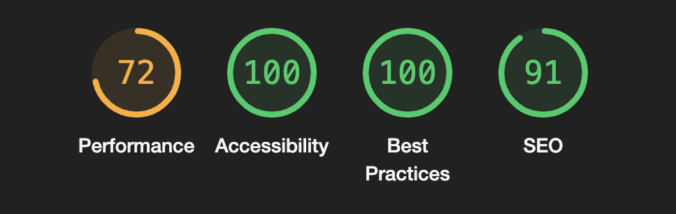

# Kids Summer Club

The Kids Summer Club website is site to a club that provides a fun and engaging summer experience for kids aged 6- 16. 
Users to the website will be able to find all the information they about the club, what activities we offer and how to register their child.

## Features:

- Navigation: 

  The page has a main menu with links to Home, Activties, About Us, Register sections. Its easy to use so users can quickly find the information they need.

  

- Home Page:

  This section welcomes the user and explains what the summer club is about. This helps parents and kids understand the purpose of the club and get excited about joining.

  

- Activities: 
  
  This section gives more details about the activities like arts and carfts, fun games, sports, role play and messy play. 
  Provides detail information so parents and kids know exactly what kind of fun they will have.

  

- Schedule and Activities:
  - Schedule Table: Shows schedule of activitities for different age groups.
  - Activities description: Describes each type of activity we offer.
  Helps parents and kids know what to expect each day and choose the right activity for them.

  

- About Us Section:
  This section explains who we are and our mission. 

  

- Registeration Page:
 - Form: A simple form top sign up their kids for the club.
 - Input Fields: Collects data for child's name, age, parent/guardian's name, contact number, email, emergency contact, and any allergies or medical conditions.
   Making it easier for parents to register their kids, ensuring we have all the necessary information to keep kids safe and healthy.

   

## Testing:

  - I tested the this page works in differnt browsers: chrome, firefox, safari 

  - I can confirm the website works well on different devices, including mobile phones and laptops.

  - The registeration form works: requires entery for each field, will onlyu acceot email field and the submit button works.

## Validator Testing:

 - HTML

   - No errors were found when passinf throught the offical W3C validator.

- CSS

   - No erros were found when passing through the official Jisaw W3C CSS validator.

- Accessibility

  - The website uses good color contrast and includes alt text for image and accessible by running it through lighthouse inndev tools

  

## Deployment:

- The site is deployed by Github pages. 

The live link can be found here: https://agodahdev.github.io/project1/

## Credit: 

- Content:
  - The code for the social media links in the footer was taken from the https://agodahdev.github.io/loverunning/ project 
  - The form validation when user fills in the form correctly was also taken from the loverunning project above.

- Media:

 - The pictures used for taken from Pexels.com