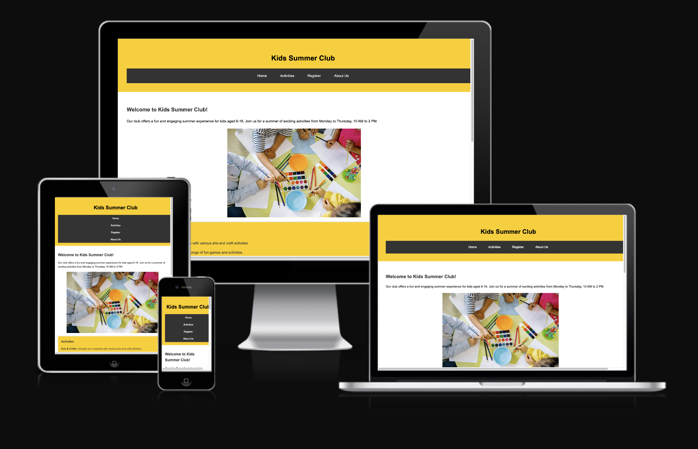

# Kids Summer Club

The Kids Summer Club website is site to a club that provides a fun and engaging summer experience for kids aged 6- 16. 
Users to the website will be able to find all the information they about the club, what activities we offer and how to register their child.

## Features:

- Navigation: 

  The page has a main menu with links to Home, Activties, About Us, Register sections. Its easy to use so users can quickly find the information they need.

- Home Page:

  This section welcomes the user and explains what the summer club is about. This helps parents and kids understand the purpose of the club and get excited about joining.

- Activities: 
  
  This section gives more details about the activities like arts and carfts, fun games, sports, role play and messy pplay. 

